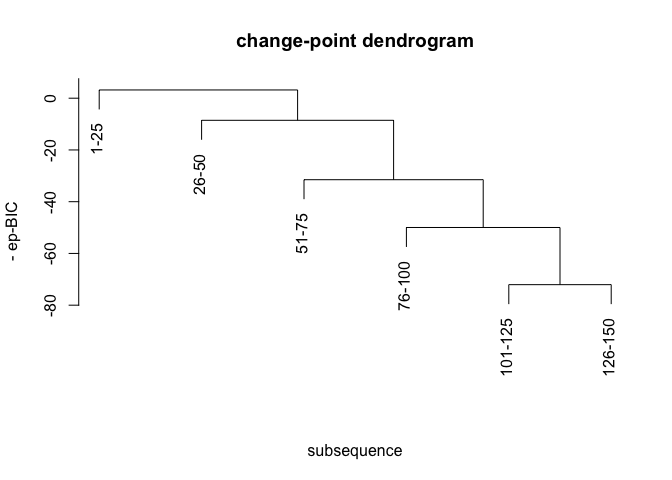

# gMulti

<!-- badges: start -->
<!-- badges: end -->

This package uses graph-based scan statistics to detect multiple
change-points in a high-dimensional data. It involves the use of
generalized scan statistics, wild binary segmentation and model
selection.

## Example

``` r
library(gMulti)
library(mvtnorm)
n = 150
rho = 0.3
d = 100
Sigma = matrix(0, ncol = d, nrow = d)
for(i in 1:d){
  for(j in 1:d){
    Sigma[i,j] = rho^abs(i - j)
}}
y = matrix(0, ncol = d, nrow = 0)
for(l in 1:3){
    y = rbind(y, rmvnorm(25, rep(0, d), Sigma), 
        rmvnorm(25, c(rep(1, d * 0.2), rep(0, d * 0.8)), 2 * Sigma))
}
step1 = gWBS(y) # step 1: searching by WBS
step2 = gBE(y, step1, detail = TRUE) # step 2: pruning by backward elimination
```

``` r
print(step2)
#> $tauhat
#> [1]  25  50  75 100 125
#> 
#> $gofSeq
#> [1] 44.998995 72.069798 49.970061 31.503429  8.544482 -3.187303
#> 
#> $mergeSeq
#> [1]  79 125 100  75  50
cpdendrogram(y, step2) # plot change-point dendrogram
```



## Reference

Zhang, Yuxuan, and Hao Chen. “Graph-based multiple change-point
detection.” arXiv preprint arXiv:2110.01170 (2021).
